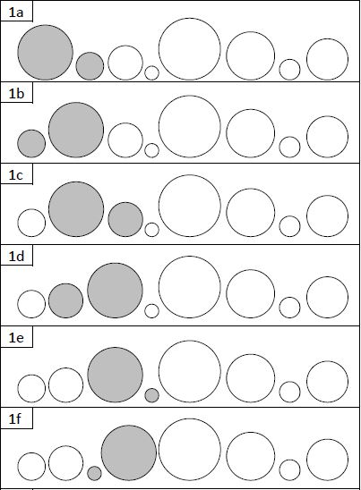
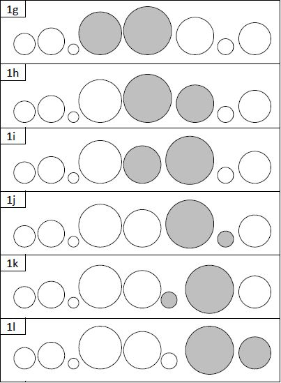

# Activité sans ordinateur
# Le tri à bulles

###### Par _Clémentine Mariage_
###### Travail  basé sur [_les propositions d'activité sans ordinateur de l'Université de Clermont-Ferrand_](http://www.irem.univ-bpclermont.fr/Algorithmique.html)

## Présentation
### Objectif:
Comprendre le principe de l'algorithme de tri à bulles

### Public cible:
Élèves de 3e sans connaissances particulières en informatique. Cette activité peut être effectuée aupres d'élèves de 6e ou 5e si des activités de programmation de base leur ont 
déjà été dispensées.

### Durée de l'activité
L'activité se déroulera sur deux séances.
La première partie se concentrera sur la construction de l'algorithme par les les élèves puis la reprise de la réflexion par l'animateur.  
La seconde partie permettra d'aborder la notion de boucles et d'étendre la réflexion algorithmique à d'autres algorithmes, ainsi qu'à des exemples concrets.

### Matériaux: 
7 Cercles en carton ou en  papier plastifié, de taille croissante et identifiés par des chiffres allant de 1 à 7 (1 étant le plus petit, 7 le plus grand).
Il faudra un ensemble de 7 cercles par groupe d'élèves. L'animateur aura également besoin d'un ensemble de cercles, positionnables de manière à être vus par toute la 
classe (magnétiques, par exemple).

### Groupes:
Les apprenants seront en groupe de deux pour l'activité. La construction de binômes permettra à l'animateur de choisir, pour chaque groupe, des apprenants qui se complémentarisent, 
tout en gardant un environnement calme en classe lors des moments de réflexion.

### Notions abordées:
* Réflexion logique (Construction d'une réflexion étape par étape)
* Introduction aux algorithmes (de l'exemple montré par cette activité, nous pouvons généraliser à tous les algorithmes: "une ligne, une instruction", les boucles, etc...)

---

## Déroulement de l'activité

### Consigne donnée aux élèves
Voici la consigne qui sera donnée aux élèves lors du début de l'activité, après la distribution des cercles:

>"Mélangez vos cercles puis alignez-les toujours mélangés de gauche à droite. Votre but est de ranger ces cercles du plus petit, à gauche, au plus grand, à droite.  
>Vous ne pouvez échanger que **deux cercles à la fois**.  
>Sur une feuille, vous noterez à chaque fois que vous:
> * passerez à une nouvelle paire de cercles (_"on passe à cercle n°x et cercle n°y"_)
> * étudierez leur taille (_"cercle n°x est-il plus grand que cercle n°y?"_)
> * appliquerez votre conclusion (_"on échange cercle n°x et cercle n°y"_, ou bien _"on laisse les cercles en place"_)
> 
>Vous pouvez copier exactement ces formulations."

### Première séance
1. L'animateur distribue un ensemble de cercles par binôme. Chaque groupe travaille pour soi. Les apprenants trient leurs cercles en fonction de la consigne. L'animateur s'assurera que chaque groupe n'oublie
aucune étape au niveau de la trace écrite.

2. Répétition de l'exercice: l'animateur, au tableau, refait l'exercice de réflexion à voix haute à l'aide de ses propres cercles, écrit chaque étape du tri
au tableau. Dans le même temps, il fait participer les élèves en leur demandant des suggestions pour les étapes du tri. Les élèves s'aideront du travail effectué en 
étape 1 pour répondre.

Conclusion de la première séance: "Vous venez d'écrire un algorithme, félicitaions!". L'animateur peut proposer aux élèves de réfléchir avant la prochaine séance, à ce qu'est un algorithme, 
à partir du travail qu'ils ont effectué. Il leur précisera que la notion d'algorithme sera explicitée à la séance suivante. Les élèves devront garder le brouillon qu'ils ont écrit pour avoir
un rappel sous les yeux lors de leur deuxième séance.

### Deuxième séance
Pour cette seconde séance, l'animateur garde avec lui son ensemble de cercles au cas où une représentation visuelle est nécessaire pour illustrer une explication.
3. L'animateur réécrit les instructions (établies à la séance précédente) au tableau, et anime un échange entre lui et les élèves pour réfléchir à la question:
"Peut-on simplifier notre description des étapes? Y a-t-il des lignes qui se ressemblent?", dans le but d'introduire la notion des boucles. 
Petit à petit, il remplacera certaines des lignes par des phrases telles que: "Tant qu'on n'est pas à la fin de la ligne de cercles", 
"On refait ces instructions avec le dernier élément en moins", et ainsi de suite.

4. L'animateur peut maintenant donner une **conclusion**: "Si l'on remplace les mots que l'on a écrit en français par du vocabulaire de langage informatique, nous obtenons 
un algorithme fonctionnel, compréhensible par un ordinateur." L'animateur est encouragé à ajouter "Vous avez écrit un programme informatique!" pour encourager les élèves et leur montrer
l'intérêt de leur travail.

5. Pour aider les apprenants à mieux comprendre l'intérêt de leur travail, l'animateur leur demande comment, à leur avis, cet algorithme est utilisé au quotidien. Dans cette étape, le but 
de l'animateur est de guider les élèves vers des réponses comme :
   * afficher des articles du moins cher au plus cher sur les sites de vente en ligne
   * afficher les vidéos les plus récentes sur Youtube
Il est important que les élèves trouvent la réponse par eux-même. Ici, l'animateur ne doit que les guider, et leur donner des pistes.

6. Étape de généralisation: l'animateur explique aux élèves ce qu'est un algorithme (une série d'instructions simples et logiques) et que tous les algorithmes ont cette manière de fonctionner.
Il peut donner en exemple des algortihmes comme:
   * Le calcul d'exponentielles
   * Un jeu de plateau (tant que personne n'a gagné, le jeu et les instructions continuent)

Le but de ces étapes est de mener l'élève, en partant d'un problème simple et à instructions basiques, à se rendre compte du fonctionnement d'un algorithme. De plus, l'apport régulier 
d'exemples d'utilisation permet à l'élève de réaliser l'aspect concret de cette activité et peut déclencher chez lui un effet "c'est donc cela!" qui l'aidera à rester engagé dans l'activité.

---

## Méthodologies d'apprentissage mises en pratique dans cette activité
* **Behaviorisme**: par répétition de l'activité par l'animateur au tableau
* **Constructivisme**: par la rflexion à la résolution d'un problème donné aux élèves
* **Socioconstructivisme**: par la mise en place des binômes

---

##### Cette activité est sous licence Creative Commons

